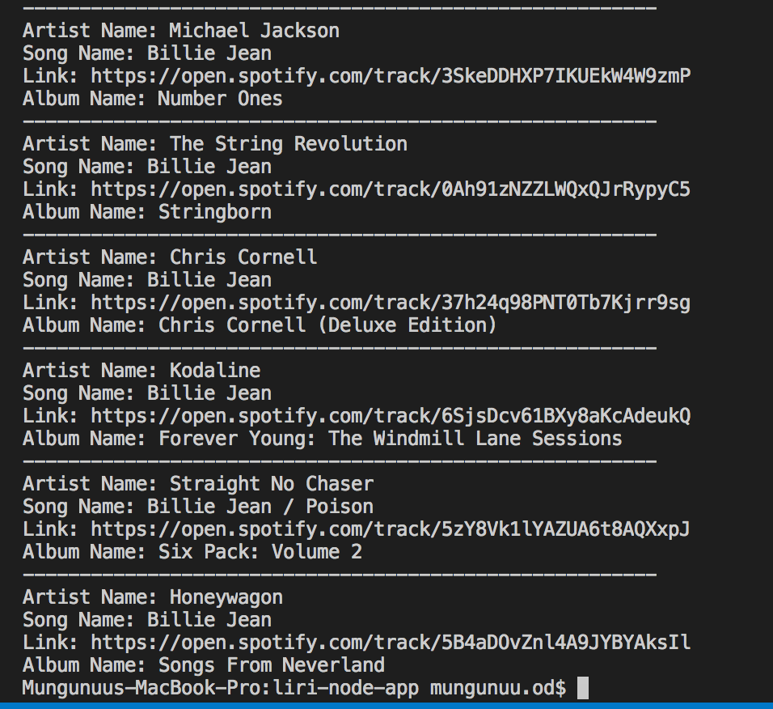

# liri-node-app
LIRI is a _Language_ Interpretation and Recognition Interface. LIRI will be a command line node app that takes in parameters and gives you back data.
LIRI will search Spotify for songs, Bands in Town for concerts, and OMDB for movies.

First of all you'll need to send requests using the `axios` package to the Bands in Town, Spotify and OMDB APIs.

1. node liri.js concert-this ladygaga

2. node liri.js spotify-this-song "billie jean"

3. node liri.js movie-this avatar

4. node liri.js do-what-it-says

5. Video  

